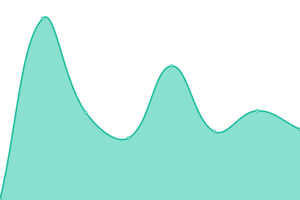
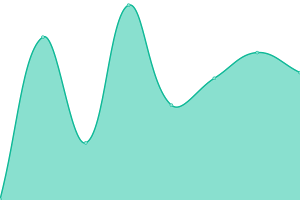
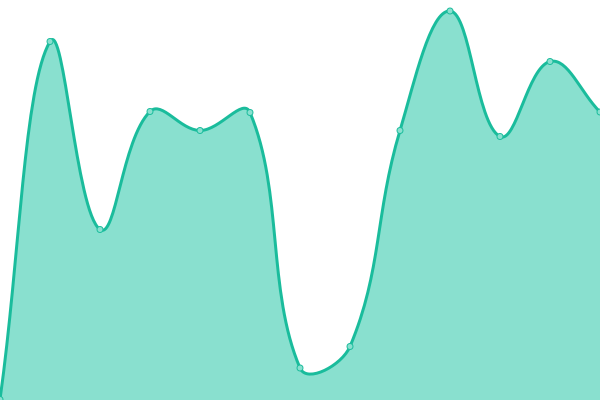
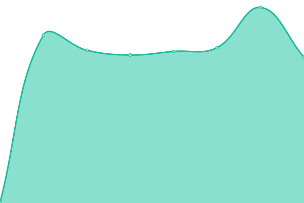
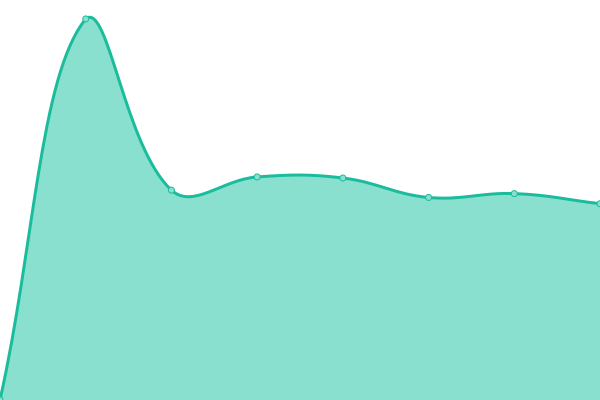

# Scratch Upptime 2 (unofficial)

Welcome to **[Scratch](https://scratch.mit.edu)**'s (unofficial) second Upptime status repository.

This is the status repository for less-known services related to [Scratch](https://scratch.mit.edu). There is no status page that is made by folks on Scratch, hence the status page and it's repository.

The page and it's repository monitors them for free, using only GitHub services, thanks to [Upptime](https://github.com/upptime/upptime).

The page and it's repository only checks a subset of the services that are present. The list that checks all of the Scratch servers/services/subdomains are as follows.

- Scratch Upptime ([website](https://scratch-upptime.netlify.app), [repository](https://github.com/Hans5958/Scratch-Upptime))  
  For known/important services that are frequently used
- Scratch Upptime 2 ([website](https://scratch-upptime-2.netlify.app), [repository](https://github.com/Hans5958/Scratch-Upptime-2))  
  For less-known services, staging/beta/alpha services, redirects, etc
- Scratch Wiki Upptime ([website](https://scratch-wiki-upptime.netlify.app), [repository](https://github.com/Hans5958/Scratch-Wiki-Upptime))  
  For all the Scratch Wiki subdomains

Live status: <!--live status--> **🟩 All systems operational**

## [📈 Status](https://scratch-upptime-2.netlify.app)

<!--start: status pages-->
<!-- This summary is generated by Upptime (https://github.com/upptime/upptime) -->
<!-- Do not edit this manually, your changes will be overwritten -->
<!-- prettier-ignore -->
| URL | Status | History | Response Time | Uptime |
| --- | ------ | ------- | ------------- | ------ |
|  [Scratch Lab website](https://lab.scratch.mit.edu) | 🟩 Up | [scratch-lab-website.yml](https://github.com/Hans5958/Scratch-Upptime-2/commits/HEAD/history/scratch-lab-website.yml) | 

 119ms
     
 | 

<a href="https://scratch-upptime-2.netlify.app/history/scratch-lab-website">100.00%</a>
    

|  [ScratchX website](https://scratchx.org) | 🟩 Up | [scratch-x-website.yml](https://github.com/Hans5958/Scratch-Upptime-2/commits/HEAD/history/scratch-x-website.yml) | 

 217ms
     
 | 

<a href="https://scratch-upptime-2.netlify.app/history/scratch-x-website">100.00%</a>
    

|  [ScratchJr website](https://www.scratchjr.org) | 🟩 Up | [scratch-jr-website.yml](https://github.com/Hans5958/Scratch-Upptime-2/commits/HEAD/history/scratch-jr-website.yml) | 

 211ms
     
 | 

<a href="https://scratch-upptime-2.netlify.app/history/scratch-jr-website">100.00%</a>
    

|  [ScratchEd website](http://scratched.gse.harvard.edu) | 🟩 Up | [scratch-ed-website.yml](https://github.com/Hans5958/Scratch-Upptime-2/commits/HEAD/history/scratch-ed-website.yml) | 

 234ms
     
 | 

<a href="https://scratch-upptime-2.netlify.app/history/scratch-ed-website">100.00%</a>
    

|  [Scratch Foundation website](https://scratchfoundation.org) | 🟩 Up | [scratch-foundation-website.yml](https://github.com/Hans5958/Scratch-Upptime-2/commits/HEAD/history/scratch-foundation-website.yml) | 

 504ms
     
 | 

<a href="https://scratch-upptime-2.netlify.app/history/scratch-foundation-website">99.69%</a>
    

|  [Scratch Day website](https://day.scratch.mit.edu) | 🟩 Up | [scratch-day-website.yml](https://github.com/Hans5958/Scratch-Upptime-2/commits/HEAD/history/scratch-day-website.yml) | 

 239ms
     
 | 

<a href="https://scratch-upptime-2.netlify.app/history/scratch-day-website">100.00%</a>
    

|  [Scratch in Practice website](https://sip.scratch.mit.edu) | 🟩 Up | [scratch-in-practice-website.yml](https://github.com/Hans5958/Scratch-Upptime-2/commits/HEAD/history/scratch-in-practice-website.yml) | 

 0ms
     
 | 

<a href="https://scratch-upptime-2.netlify.app/history/scratch-in-practice-website">100.00%</a>
    

|  [Test website](https://scratch.ly) | 🟩 Up | [test-website.yml](https://github.com/Hans5958/Scratch-Upptime-2/commits/HEAD/history/test-website.yml) | 

 154ms
     
 | 

<a href="https://scratch-upptime-2.netlify.app/history/test-website">100.00%</a>
    

|  [Test download server](https://downloads.scratch.ly) | 🟩 Up | [test-download-server.yml](https://github.com/Hans5958/Scratch-Upptime-2/commits/HEAD/history/test-download-server.yml) | 

 158ms
     
 | 

<a href="https://scratch-upptime-2.netlify.app/history/test-download-server">100.00%</a>
    

|  [Assets CDN server](https://cdn.assets.scratch.mit.edu) | 🟩 Up | [assets-cdn-server.yml](https://github.com/Hans5958/Scratch-Upptime-2/commits/HEAD/history/assets-cdn-server.yml) | 

 100ms
     
 | 

<a href="https://scratch-upptime-2.netlify.app/history/assets-cdn-server">100.00%</a>
    

|  [Project CDN server](https://cdn.projects.scratch.mit.edu) | 🟩 Up | [project-cdn-server.yml](https://github.com/Hans5958/Scratch-Upptime-2/commits/HEAD/history/project-cdn-server.yml) | 

 68ms
     
 | 

<a href="https://scratch-upptime-2.netlify.app/history/project-cdn-server">100.00%</a>
    

|  [Redirect: scratch.org](https://scratch.org) | 🟩 Up | [redirect-scratch-org.yml](https://github.com/Hans5958/Scratch-Upptime-2/commits/HEAD/history/redirect-scratch-org.yml) | 

 282ms
     
 | 

<a href="https://scratch-upptime-2.netlify.app/history/redirect-scratch-org">100.00%</a>
    

|  [Redirect: scratch.love](https://scratch.love) | 🟩 Up | [redirect-scratch-love.yml](https://github.com/Hans5958/Scratch-Upptime-2/commits/HEAD/history/redirect-scratch-love.yml) | 

 155ms
     
 | 

<a href="https://scratch-upptime-2.netlify.app/history/redirect-scratch-love">100.00%</a>
    

|  [Redirect: scratch.computer](https://scratch.computer) | 🟩 Up | [redirect-scratch-computer.yml](https://github.com/Hans5958/Scratch-Upptime-2/commits/HEAD/history/redirect-scratch-computer.yml) | 

 215ms
     
 | 

<a href="https://scratch-upptime-2.netlify.app/history/redirect-scratch-computer">100.00%</a>
    

|  [Redirect: scratch.chat](https://scratch.chat) | 🟩 Up | [redirect-scratch-chat.yml](https://github.com/Hans5958/Scratch-Upptime-2/commits/HEAD/history/redirect-scratch-chat.yml) | 

 116ms
     
 | 

<a href="https://scratch-upptime-2.netlify.app/history/redirect-scratch-chat">100.00%</a>
    

|  [Redirect: scratch.land](https://scratch.land) | 🟩 Up | [redirect-scratch-land.yml](https://github.com/Hans5958/Scratch-Upptime-2/commits/HEAD/history/redirect-scratch-land.yml) | 

 127ms
     
 | 

<a href="https://scratch-upptime-2.netlify.app/history/redirect-scratch-land">100.00%</a>
    

|  [Redirect: scratch.rest](https://scratch.rest) | 🟩 Up | [redirect-scratch-rest.yml](https://github.com/Hans5958/Scratch-Upptime-2/commits/HEAD/history/redirect-scratch-rest.yml) | 

 176ms
     
 | 

<a href="https://scratch-upptime-2.netlify.app/history/redirect-scratch-rest">100.00%</a>
    

|  [Redirect: scratch.team](https://scratch.team) | 🟩 Up | [redirect-scratch-team.yml](https://github.com/Hans5958/Scratch-Upptime-2/commits/HEAD/history/redirect-scratch-team.yml) | 

 103ms
     
 | 

<a href="https://scratch-upptime-2.netlify.app/history/redirect-scratch-team">100.00%</a>
    

|  [Redirect: scratch.camp](https://scratch.camp) | 🟩 Up | [redirect-scratch-camp.yml](https://github.com/Hans5958/Scratch-Upptime-2/commits/HEAD/history/redirect-scratch-camp.yml) | 

 240ms
     
 | 

<a href="https://scratch-upptime-2.netlify.app/history/redirect-scratch-camp">100.00%</a>
    

|  [Redirect: scratch.pizza](https://scratch.pizza) | 🟩 Up | [redirect-scratch-pizza.yml](https://github.com/Hans5958/Scratch-Upptime-2/commits/HEAD/history/redirect-scratch-pizza.yml) | 

 228ms
     
 | 

<a href="https://scratch-upptime-2.netlify.app/history/redirect-scratch-pizza">100.00%</a>
    

<!--end: status pages-->

## 📄 License

- Code: [MIT](./LICENSE)
- Data in the `./history` directory: [Open Database License](https://opendatacommons.org/licenses/odbl/1-0/)
